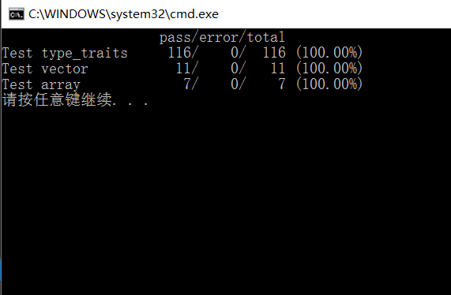
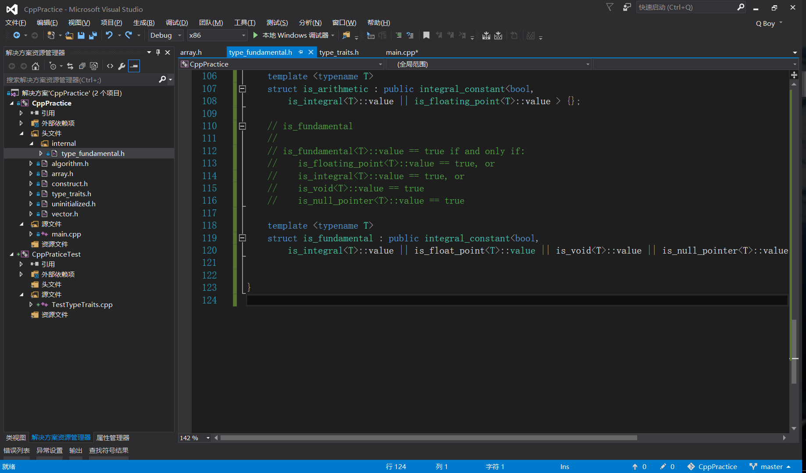

# CppPractice

## 介绍
这个库是用来练习和学习C++的，这是一个实现stl的库。

本来看了侯捷先生的书《STL源码剖析》后，准备借鉴SGI STL的，去官网下载了一份，发现不能编译。就放弃转而使用EASTL。

非常感谢 [EASTL](https://github.com/electronicarts/EASTL),我从这里学到了很多东西。

## 如何使用
使用 VS2015 Update3 编译&运行

目前的单元测试:

*practice* of c++

A library for learning c++ and it is same as stl.

thanks for the library [EASTL](https://github.com/electronicarts/EASTL)

