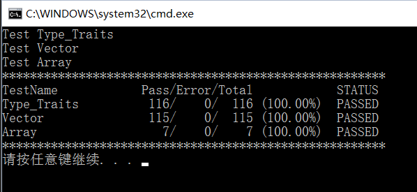

# CppPractice

这个库是用来练习和学习C++的，这是一个实现stl的库。

非常感谢 EASTL， 我从这里学到了很多东西。

目前的单元测试:

*practice* of c++

A library for learning c++ and it is same as stl.

thanks for the library [EASTL](https://github.com/electronicarts/EASTL)

